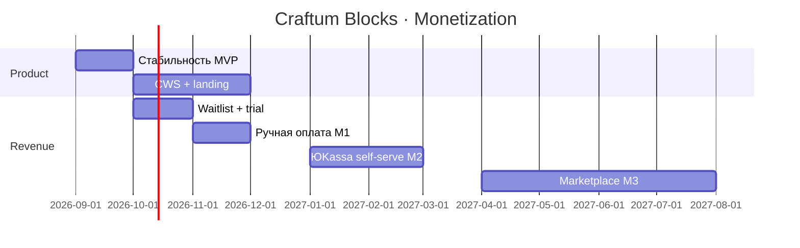

# План монетизации · Craftum Blocks

Документ для принятия решений после стабилизации MVP (фаза 1–2 roadmap). Обновлять по факту первых платящих.

**Связано:** [philosophy.md](./philosophy.md) · [roadmap.md](./roadmap.md) · [architecture.md](./architecture.md)

---

## 1. Принципы

| Принцип | Пояснение |
|---------|-----------|
| **Вставка бесплатна** | Расширение и чтение каталога — без paywall, пока нет product-market fit |
| **Платят авторы и студии** | Деньги там, где создают и продают блоки, а не там, где один раз вставили hero |
| **Не DRM snapshot** | JSON в API виден — защита через лицензию и доверие, не obfuscation |
| **Craftum — партнёр, не конкурент** | Мы слой «мои блоки», не замена редактора |
| **Сначала B2B студии** | Первые ₽ — от 5–20 студий на Craftum, не массовый B2C |

---

## 2. Целевые сегменты

| Сегмент | Боль | Готовность платить |
|---------|------|-------------------|
| **Фрилансер на Craftum** | Копирует одни блоки между проектами | Низкая → freemium |
| **Веб-студия (3–15 чел.)** | Общая библиотека блоков, бренд клиента | **Высокая** |
| **Автор блоков / шаблонов** | Хочет продавать наборы | Средняя (после аудитории) |
| **Клиент студии** | Только вставляет | Не платит напрямую |

**ICP (ideal customer profile) на старте:** студия на Craftum, 5+ сайтов в год, уже делает дизайн-блоки вручную.

---

## 3. Модель дохода (рекомендация: гибрид B + C)

### Поток A · Подписка студии (основной MRR)

Командный каталог: свои блоки + curated набор Nordic Builder.

| Тариф | Цена (ориентир) | Лимиты |
|-------|-----------------|--------|
| **Free** | ₽0 | До 5 своих блоков, публикация 1 блок/мес, общий каталог community |
| **Author** | ₽990 / мес | До 30 блоков, безлимит publish, превью, категории |
| **Studio** | ₽4 900 / мес | До 5 авторов, общий каталог студии, приоритет в галерее |
| **Studio+** | ₽14 900 / мес | Безлимит блоков, white-label landing, API-ключ на команду |

Годовая оплата: −20%.

### Поток B · Маркетплейс паков (разовые + revshare)

Готовые наборы: «Hero 2026», «Формы + CRM», «Лендинг SaaS».

| Формат | Цена | Доля платформы |
|--------|------|----------------|
| Пак 5–10 блоков | ₽1 490 – 4 990 | 30% |
| Подписка на пак автора | ₽490 / мес | 30% |

Аналог ThemeForest, но только snapshot Craftum — вставка в 1 клик.

### Поток C · Услуги (опционально, не автоматизировать рано)

- Настройка каталога под студию — ₽15 000 разово  
- Миграция блоков с Kraftum/Craftum проекта — через Craft migration engine, cross-sell  

---

## 4. Что входит в платные тарифы (product packaging)

| Функция | Free | Author | Studio |
|---------|------|--------|--------|
| Вставка из community-каталога | ✅ | ✅ | ✅ |
| Publish своих блоков | 1/мес | ∞ | ∞ |
| Блоков в каталоге | 5 | 30 | ∞ |
| Превью (загрузка фото) | ✅ | ✅ | ✅ |
| Категории CRUD | только чтение | ✅ | ✅ |
| «Мои блоки» vs «Каталог студии» | — | — | ✅ |
| Несколько publish-ключей | 1 | 1 | до 5 |
| Страница автора `/craftum-blocks/u/{slug}` | — | ✅ | ✅ |
| Featured в community | — | заявка | приоритет |

**Не монетизировать в v1:** количество вставок, скорость insert, cover/hero legacy-режимы.

---

## 5. Этапы запуска монетизации

### Этап M0 · Подготовка (сейчас → +4 нед)

**Цель:** можно принять деньги вручную, не ломая бесплатный контур.

| # | Задача |
|---|--------|
| 1 | Стабильность insert + админка (тестирование) |
| 2 | Landing `/craftum-blocks` — ценность + тарифы (можно «скоро») |
| 3 | Оферта + политика конфиденциальности (шаблон для РФ) |
| 4 | Список waitlist (форма / Telegram) |
| 5 | 3–5 студий на бесплатном Studio trial 60 дней |

**KPI:** 5 студий активно публикуют блоки; 0 критичных багов insert.

### Этап M1 · Ручная оплата (+2–4 нед после M0)

**Цель:** первый платящий без автоматизации.

| # | Задача |
|---|--------|
| 1 | Счёт / перевод / ЮKassa ссылка вручную |
| 2 | В `.env` / admin: `studioId` + publish-ключ на студию |
| 3 | Фильтр каталога: `studioId` → только свои + public |
| 4 | Договор оферты PDF по запросу |

**KPI:** 1–3 платящих Studio; ₽15k+ MRR суммарно.

### Этап M2 · Billing в продукте (+6–8 нед)

**Цель:** self-serve подписка.

| # | Задача | Техника |
|---|--------|---------|
| 1 | Регистрация студии | email + magic link или OAuth |
| 2 | JWT / API-key в расширении | замена одного `CRAFTUM_BLOCKS_PUBLISH_KEY` |
| 3 | Оплата | **ЮKassa** (РФ) или Stripe (если зарубеж) |
| 4 | Webhook `payment.succeeded` | Postgres `subscriptions`, `studios`, `authors` |
| 5 | Лимиты в publish API | 402 при превышении блоков/месяца |
| 6 | Личный кабинет | `/craftum-blocks/account` — тариф, ключи, счета |

**Схема данных (минимум):**

```
studios(id, name, slug, plan, publish_key_hash, blocks_limit, created_at)
subscriptions(studio_id, plan, status, expires_at, provider_id)
blocks(..., studio_id, visibility: public|studio|private)
```

**KPI:** 10+ Studio; churn <10%/мес; оплата без участия поддержки.

### Этап M3 · Маркетплейс (+3–6 мес после M2)

| # | Задача |
|---|--------|
| 1 | Страница пака + checkout |
| 2 | `authorId`, revshare, выплаты раз в месяц |
| 3 | Модерация (превью, жалобы) |
| 4 | Рейтинг / «популярное» в галерее |

**KPI:** 20+ платных паков; 30% выручки с marketplace.

---

## 6. Go-to-market

### Каналы (по приоритету)

1. **Существующие клиенты Nordic Builder / Craft migration** — уже на Craftum/Kraftum  
2. **Telegram / чаты веб-студий** — демо 30 сек (publish → insert)  
3. **Chrome Web Store** — после фазы 3 roadmap (доверие + SEO)  
4. **Контент:** «как продать блок повторно», кейсы студий  
5. **Партнёрство Craftum** — только после 100+ installs и стабильных метрик  

### Позиционирование vs ANNEXX / ручное копирование

| Мы | Они |
|----|-----|
| Snapshot = редактируется в Craftum | Часто HTML / мёртвый код |
| Русский каталог + миграция Craft | Зарубежные или DIY |
| Студийный каталог + монетизация авторов | Один общий набор |

### Trial и onboarding

- **14–60 дней Studio бесплатно** для первых 10 студий (ручной онбординг)  
- Онбординг в расширении: install → вставка demo-блока → «хотите свои? — тариф Author»  
- Publish-ключ только у paying / trial studio (уже есть механизм admin-check)

---

## 7. Юридическое и риски (РФ)

| Тема | Действие |
|------|----------|
| Оферта на оказание услуг | Шаблон на `craft.nordic-builder.ru/legal/offer` |
| Персональные данные | Политика; в расширении — только storage ключа, без PII в Sentry |
| ИП / самозанятость / ООО | Решить до M1 (куда выводить ₽) |
| Авторские права на блоки | В ToS: автор гарантирует права; платформа — агрегатор |
| Возвраты | 7 дней на паки; подписка — пропорционально неиспользованного (простая формулировка) |
| НДС | Уточнить с бухгалтером при ₽500k+ / год |

---

## 8. Метрики

### North Star

**Количество успешных вставок snapshot в неделю** (по всем пользователям) — прокси ценности каталога.

### Воронка монетизации

```
Install расширения
  → Открыл галерею (+)
    → Вставил блок
      → (автор) Publish блок
        → Trial Studio
          → Paid Studio
            → Marketplace purchase
```

### Дашборд (ручной → потом автомат)

| Метрика | Цель M1 | Цель M2 |
|---------|---------|---------|
| Активные installs | 50 | 300 |
| WAU (открыли галерею) | 20 | 100 |
| Insert success rate | >95% | >97% |
| Опубликованных блоков | 30 | 200 |
| Платящих студий | 3 | 15 |
| MRR | ₽15k | ₽75k |
| ARPU (Studio) | ₽5k | ₽5k |

---

## 9. Технический backlog (только для monetization)

Не делать до M1, но заложить в архитектуру:

| Приоритет | Задача |
|-----------|--------|
| P0 | `studioId` + `visibility` на блоке в `catalog.json` → Postgres |
| P0 | Publish API: проверка лимита блоков / плана |
| P1 | JWT вместо одного publish key (rotation) |
| P1 | GET catalog: `?studio=slug` + public blocks |
| P1 | Account UI + ЮKassa checkout |
| P2 | Marketplace checkout + entitlements в расширении |
| P2 | Payouts авторам (раз в месяц, минимум ₽3000) |
| P3 | CDN превью (не с `public/` на Next) |

---

## 10. Что не делать рано

- Paywall на **вставку** community-блоков  
- DRM / шифрование snapshot  
- Отдельный микросервис до 10k блоков  
- Мобильное приложение  
- AI-генерация блоков как paid feature до стабильного insert  

---

## 11. Дорожная карта на 12 месяцев



| Квартал | Фокус | Выручка (ориентир) |
|---------|-------|-------------------|
| Q3 2026 | MVP + админка + тестеры | ₽0 |
| Q4 2026 | Trial студий, ручные оплаты | ₽15–50k |
| Q1 2027 | Billing, 10–15 Studio | ₽50–100k MRR |
| Q2 2027 | Marketplace v1, CWS рост | ₽100–200k MRR |

---

## 12. Решение «с чего начать после тестов»

Когда закончите тест (удаление, превью, категории):

1. **Зафиксировать 3 тарифа** на landing (можно без оплаты — кнопка «Запросить Studio trial»).  
2. **10 студий в waitlist** — личное сообщение + demo.  
3. **Первый платёж вручную** — один Studio, выдать отдельный publish-key в admin.  
4. **Только потом** — Postgres + ЮKassa (M2).

---

## Следующий документ

После первого платящего обновить этот файл: фактические цены, conversion trial→paid, отказ от неработающих каналов.
